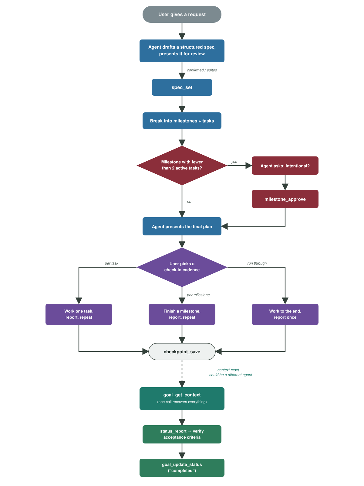

# GoalTracker MCP

**Persistent, structured project memory for AI coding agents.** GoalTracker is an MCP server that gives an agent like Claude Code a real plan to work from — `Goal → Spec → Milestone → Task → Note` — stored in a single SQLite file, so a context reset (or a completely different agent picking up the same work) is a 1-tool-call recovery, not a "let me re-read the whole conversation" guessing game.

## Why

Long-running coding work rarely fits in one session. An ad-hoc todo list in chat doesn't survive a context reset, and it definitely doesn't survive a handoff to a different agent. GoalTracker fixes that by being the thing both agents actually read and write, not just describe:

- **A context-reset agent recovers everything in one call.** `goal_get_context` returns the goal, the confirmed spec, every milestone with its task counts, and the last checkpoint — no re-deriving the plan from memory.
- **A different agent (or a different session, hours or days later) sees the real state**, including *why* something is blocked, not just that it is.
- **The MCP never guesses on your behalf.** It stores and returns structured data; all planning judgment stays with the agent — and, for the two places that matter most (finalizing a spec, approving a too-small milestone), with you.

## Quick start

```bash
npm install -g goaltracker
```

Add it to your MCP client config (Claude Code, Claude Desktop, etc.):

```json
{
  "mcpServers": {
    "goaltracker": {
      "command": "npx",
      "args": ["-y", "goaltracker"]
    }
  }
}
```

(If installed globally, `"command": "goaltracker"` works without `npx`.)

Then install the companion skill, which teaches the agent the correct call sequence — session warm-up, spec confirmation before breaking milestones, the milestone-approval flow, checkpoint habits:

```bash
npx goaltracker install-skill              # personal — ~/.claude/skills/, every project
npx goaltracker install-skill --project     # this project only — ./.claude/skills/
```

That's it. Data lives in a single SQLite file, created automatically on first run at `~/.goaltracker/goaltracker.db` (override with `GOALTRACKER_DB_PATH`). Schema upgrades apply themselves on startup — you never run a migration by hand.

## A worked example

A goal, planned, confirmed with you, worked on at whatever pace you choose, handed off to a second agent, and closed — the way it actually plays out with the skill installed:



In short: nothing gets broken into milestones until you've confirmed the spec, and nothing starts running until you've confirmed the final plan and picked how often the agent checks in with you. `checkpoint_save` closes every stop. A completely different agent (a different session, hours or days later — even a different Claude) recovers everything with one `goal_get_context` call, including what the previous agent was doing and why, before `status_report` and a final check against the spec close the goal out.

### Zooming in: a second agent finishes the goal

The diagram above shows the handoff as one dashed arrow. Here's what it actually looks like in practice — Session 1 ran out of context partway through; Session 2 is a fresh agent (could be a different Claude entirely) with no memory of any of it:


```
goal_list({ status: "active" })
→ [{ id: "g_42", title: "Add notification system", status: "active" }]

goal_get_context({ goal_id: "g_42" })
→ {
    goal: { title: "Add notification system", status: "active" },
    spec: { overview: "...", acceptance_criteria: [ ... ] },
    milestones: [
      { milestone: { title: "M1 — Email delivery", status: "completed" }, task_counts: { completed: 3 } },
      { milestone: { title: "M2 — Push notifications", status: "in_progress" }, task_counts: { completed: 2, in_progress: 1, blocked: 1 } }
    ],
    milestones_pending_approval: [],
    progress: { completion_pct: 62, total_tasks: 8, completed: 5, in_progress: 1, blocked: 1, pending: 1 },
    last_checkpoint: {
      current_task_id: "t_17",
      agent_summary: "M1 done and verified. Started M2 — push service is blocked: which push provider to use hasn't been decided yet.",
      next_actions: ["Ask the user to pick a push provider", "Once decided, finish t_17 then t_18"]
    }
  }
```

One call, and Agent B already knows exactly what happened — no need to ask the user to recap anything:

```
Agent B: "Picking up 'Add notification system' — M1 (email) is done. M2 (push notifications) is
blocked: which push provider do you want — Firebase Cloud Messaging, or a custom service?"

[user picks Firebase Cloud Messaging]

task_add_note({ task_id: "t_17", content: "User chose Firebase Cloud Messaging as the push provider.", type: "decision" })
task_update_status({ task_id: "t_17", status: "in_progress" })
  → [does the work] → task_update_status({ task_id: "t_17", status: "completed" })

task_list({ milestone_id: "m_2", status: "pending" })
→ [{ id: "t_18", title: "Wire up the push notification settings page" }]

task_update_status({ task_id: "t_18", status: "in_progress" })
  → [does the work] → task_update_status({ task_id: "t_18", status: "completed" })

status_report({ goal_id: "g_42" })
→ { progress: { completion_pct: 100 }, blocked_tasks: [], acceptance_criteria: [ ... ] }

[Agent B checks acceptance_criteria against the actual task evidence]

goal_update_status({ goal_id: "g_42", status: "completed" })
```

Agent A never told Agent B about the pending provider decision directly — it was written into `checkpoint_save`'s `agent_summary` / `next_actions` back in Session 1, and `goal_get_context` handed it straight to Agent B. The two agents never "talked"; the second one still finished the goal with full context.

## How it works

- **Data only, no reasoning.** The MCP stores and returns structured data. All planning judgment — how to break down work, when a spec is good enough, whether a small milestone is intentional — stays with the agent (and, via the skill, with you).
- **One hierarchy, one DB.** `Goal → Spec → Milestone → Task → Note`, all in one SQLite file. The agent only ever needs to remember `goal_id`.
- **Fast warm-up.** `goal_get_context` is the single call that replaces re-reading everything.
- **Audit trail.** Every status change carries a timestamp and, for `blocked`/`cancelled`, a required reason.
- **One real gate.** Milestones with fewer than 2 active tasks require an explicit `milestone_approve` before work can start on them — everywhere else, the MCP never rejects a call.

Full schema, every tool's exact input/output, and the design rationale behind each decision: [docs/design/DESIGN.md](docs/design/DESIGN.md).

## Tools (14 total)

| Group | Tools |
|---|---|
| Goal | `goal_create`, `goal_list`, `goal_get_context` ⭐ |
| Spec | `spec_set` |
| Milestone | `milestone_create`, `milestone_approve` |
| Task | `task_create`, `task_get`, `task_list`, `task_update_status`, `task_add_note` |
| Status | `status_report` ⭐ |
| Lifecycle | `goal_update_status`, `checkpoint_save` |

⭐ = the two calls you'll use most: warm-up at the start of a session, review before closing one. See [DESIGN.md §3](docs/design/DESIGN.md) for full input/output shapes.

## Configuration

| Variable | Default | Purpose |
|---|---|---|
| `GOALTRACKER_DB_PATH` | `~/.goaltracker/goaltracker.db` | Where the SQLite file lives |

## Development

Building from source instead of installing the published package:

```bash
git clone <this repo>
cd GoalTracker
npm install
npm run build      # generates the embedded skill content, then compiles
npm run dev         # run directly from src/ with tsx, no build step
npm run typecheck   # tsc --noEmit
npm test             # vitest
```

To point an MCP client at a local build instead of the published package:

```json
{
  "mcpServers": {
    "goaltracker": {
      "command": "node",
      "args": ["/absolute/path/to/GoalTracker/dist/index.js"]
    }
  }
}
```

The skill source lives at [.claude/skills/goaltracker/SKILL.md](.claude/skills/goaltracker/SKILL.md) — edit it there. Every script above (`build`, `dev`, `typecheck`, `test`) regenerates `src/skillContent.ts` from it automatically before running; that generated file is gitignored, don't edit it directly.
